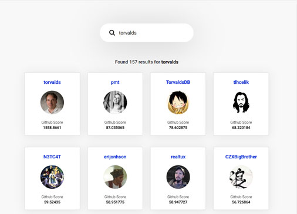

## Search github users




Project was bootstraped using create-react-app with the typescript template.

#### Scripts availble
````
npm install 
npm start
````

#### Idea
Being able to navigate to the users profile page and show list of their repositorys.
Using animation to cratee a smooth transition between the list of users and the selected user.
While keeping best pratice and showing spinners everythime we do a fetch for data. 

#### Design considerations
- Avoid the github rate limit and only the user repos on-demand. 
- I tried to avoid including to many libraies. Using react-router have been an alternative.  
- Abstracting the fetch calls into a single component which could be reused.
  The FetchData component serves as a data loader, spinner and for displaying errors.

#### Learned in the process
- I got alot of 303 when exceding the github rate-limit
 
  


#### Todo list - if i have had more time.
- write tests
- implemented pagination
- better animation 
- cleaner design 

#### Libaries used besides create-react-app:
CSS framework: ```Bootstrap 4```
Animation ```react-spring```
Gestures ```react-use-gestures```

